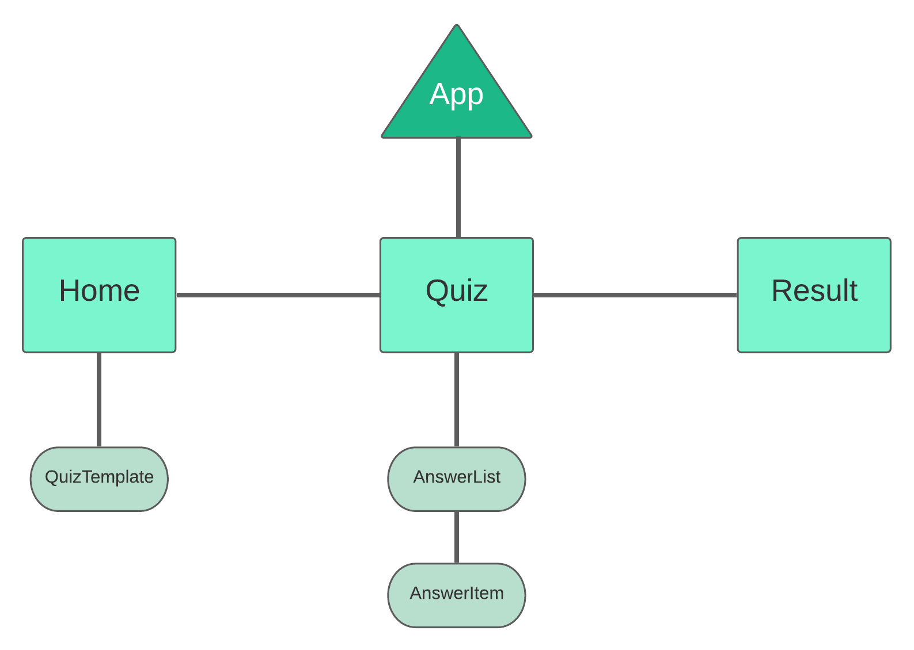

# Vue Trivia Assignment

This assignment is done through Noroff Accelerate program with Vue and Heroku

Link to Alexander's Heroku: https://aqueous-hollows-16357.herokuapp.com/

Link to Tommy's Heroku: https://damp-waters-40040.herokuapp.com/

## Table of Contents
- [Features](#features)
- [Usage](#usage)
- [Maintainers](#maintainers)

## Features

A trivia game built with the Vue framework. The player can adjust the difficulty, amount of questions and category. The game uses the Open Trivia API (https://opentdb.com/) for questions.

The DB for users uses the heroku instance for Tommy's url which can be found inside the API files.

## Component Tree

This component tree differs a lot from end solution as it was discovered while creating the solution that alterations needed to be made (and might have forgotten about it)

There are some parts of the solution that could be split up more into other components, but not deemed necessary as of now.

## Project mascot

## Maintainers
- Tommy Hamarsnes
- Alexander Maaby
